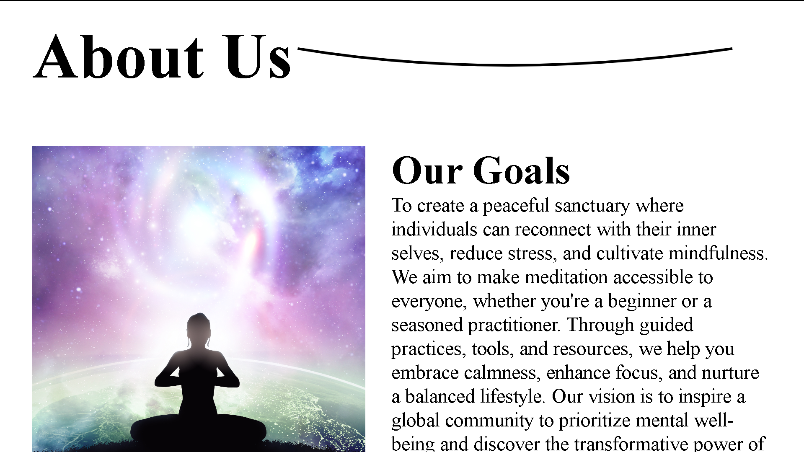

# Serenity Views

**Serenity Views** is a tranquil and immersive web experience that features serene landscape videos, each accompanied by relaxing sounds. This project is designed to provide a peaceful atmosphere through nature-inspired visuals and sounds. The website includes interactive elements that allow users to explore various views, including waterfalls, sunsets, forests, and more.

## Demo

[](https://ash-dot-coder.github.io/Project-MeditationApplication/)


## Demo-View





## Features

- **Interactive Video Cards**: The homepage showcases cards representing different serene views (e.g., waterfalls, sunsets, oceans). Clicking on a card opens a video player with the corresponding video and sound.
  
- **Smooth Scrolling**: The website utilizes [Locomotive Scroll](https://github.com/locomotivemtl/locomotive-scroll) to create a smooth scrolling effect, enhancing the visual appeal and user experience.

- **Video and Audio Playback**: When a user clicks on a view, the corresponding video plays along with its calming audio, creating an immersive experience.

- **Responsive Design**: The layout adapts to different screen sizes, ensuring a seamless experience across devices.

- **Animations with GSAP**: Smooth animations are used throughout the page using [GSAP](https://greensock.com/gsap/), adding an engaging and dynamic touch.

## Technologies Used

- **HTML**: For structuring the content.
- **CSS**: For styling the page and ensuring responsiveness.
- **JavaScript**: For functionality, including video and audio controls, animations, and smooth scrolling.
- **Locomotive Scroll**: For smooth scrolling effects.
- **GSAP**: For animations and transitions.

## Installation

To get started with **Serenity Views** locally, follow these steps:

1. **Clone the repository**:
   ```bash
   git clone https://github.com/Ash-dot-coder/Project-MeditationApplication.git
   ```